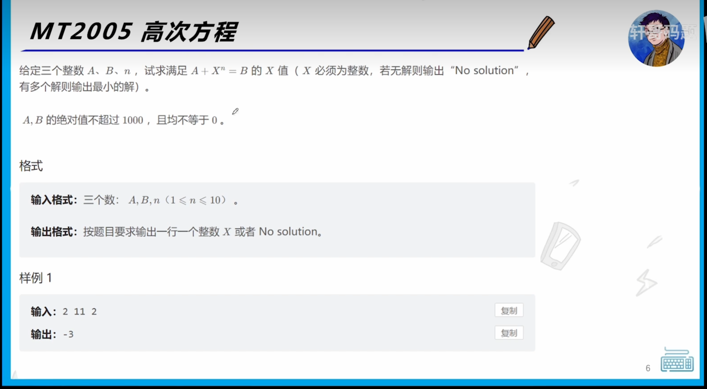

# MT 2005高次方程


## 注意可以是负数


```
#include<bits/stdc++.h> 
using namespace std;

int main(){
	int a,b,n;
	cin>>a>>b>>n;
	b-=a;
	int result = std::pow(b, 1.0 / n); 
	int ans = std::pow(result, n);
	if(ans==b){
		if(n%2==0)
			result*=-1;
		cout<<result;
	}	
	else
		cout<<"No Solution!";
	
	return 0;
}

```

